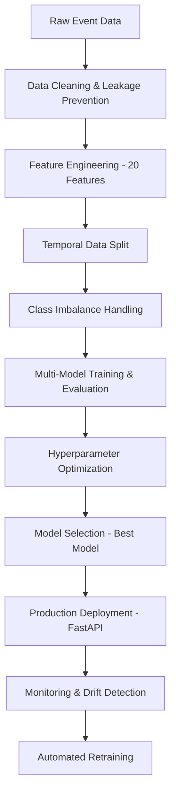

# 🎵 Music Streaming Churn Prediction

> **A comprehensive machine learning solution for predicting customer churn in music streaming platforms with production-ready MLOps implementation**

[](https://www.python.org/downloads/)
[](https://github.com/psf/black)
[](https://github.com/astral-sh/ruff)
[](https://github.com/pre-commit/pre-commit)

## 📋 Table of Contents

- [🎯 Problem Statement](#-problem-statement)
- [🏗️ Solution Architecture](#️-solution-architecture)  
- [🚀 Quick Start](#-quick-start)
- [📊 Project Structure](#-project-structure)
- [🔧 How We Solved It](#-how-we-solved-it)
- [⚠️ Main Challenges](#️-main-challenges)
- [💡 Alternative Approaches](#-alternative-approaches)
- [📈 Results & Performance](#-results--performance)
- [🐳 Docker Deployment](#-docker-deployment)
- [📚 Usage Examples](#-usage-examples)
- [🔍 Monitoring & MLOps](#-monitoring--mlops)
- [🧪 Testing](#-testing)
- [📖 Documentation](#-documentation)
- [👥 Contributing](#-contributing)

## 🎯 Problem Statement

**Challenge:** Predict customer churn for a music streaming platform where traditional churn signals are ambiguous or missing.

### Key Constraints:
- ⚡ **Ambiguous Churn Definition** - No explicit cancellation events
- 📊 **Severe Class Imbalance** - Only ~11% churn rate  
- 🔒 **High Data Leakage Risk** - Temporal event data with future information
- 🎯 **Business Critical** - False negatives cost customer lifetime value
- 🚀 **Production Requirements** - Real-time API with monitoring needed

## 🏗️ Solution Architecture

Our comprehensive ML pipeline addresses each challenge systematically:



### 🎯 **Core Innovation: Leak-Safe Temporal Architecture**
- **Temporal Splitting**: Train on historical users, test on future cohorts
- **Churn Definition**: Activity-based (30+ days inactivity) vs explicit events
- **Feature Engineering**: Only past information relative to prediction point

## 🚀 Quick Start

### Prerequisites
- Python 3.11+
- Docker (optional)
- 4GB+ RAM recommended

### 1️⃣ Environment Setup
```bash
# Clone the repository
git clone https://github.com/your-repo/churn-prediction.git
cd churn-prediction

# Setup with Makefile (recommended)
make dev-setup

# Or manual setup
python -m venv .venv
source .venv/bin/activate  # Windows: .venv\\Scripts\\activate
pip install uv
uv pip install -r requirements.txt
pre-commit install
```

### 2️⃣ Data Preparation
```bash
# Place your data file
cp your_data.json customer_churn.json

# Run exploratory data analysis
make data-eda

# Process features (with leakage prevention)
make process-data
```

### 3️⃣ Model Training
```bash
# Train multiple models with hyperparameter optimization
make train

# Evaluate model performance
make evaluate
```

### 4️⃣ Deploy API
```bash
# Start development API server
make api

# Or production deployment
make docker-run
```

**🌐 Access Points:**
- **API Docs**: http://localhost:8000/docs
- **MLflow UI**: http://localhost:5000
- **Health Check**: http://localhost:8000/health

## 📊 Project Structure

```
churn-prediction/
├── 📁 Core ML Modules
│   ├── MusicStreamingEventProcessor.py  # Data processing & feature engineering
│   ├── eval.py                         # Model evaluation & hyperparameter tuning
│   ├── split.py                        # Temporal splitting & imbalance handling
│   ├── monitor.py                      # Drift detection & monitoring
│   └── utils.py                        # Shared utilities & imports
├── 📁 Deployment
│   ├── main.py                         # FastAPI service
│   ├── deployment.py                   # Production packaging
│   └── retrain_on_drift.py             # Automated retraining
├── 📁 Analysis & Training
│   ├── dataEDA.ipynb                   # Exploratory data analysis
│   ├── Training.ipynb                  # Model training workflow
│   └── all.py                          # End-to-end orchestration
├── 📁 Testing & Quality
│   ├── test_modules.py                 # Module integration tests
│   ├── test_processor.py               # Data processor tests
│   └── .pre-commit-config.yaml         # Code quality automation
├── 📁 DevOps & Deployment  
│   ├── Dockerfile                      # Multi-stage container build
│   ├── Makefile                        # Development automation
│   ├── requirements.txt                # Python dependencies
│   └── docker-compose.yml              # Local development stack
└── 📁 Documentation
    ├── README.md                       # This file
    ├── Technical-Report.md             # Detailed technical analysis
    └── Tech_report.pdf                 # Executive summary
```

## 🔧 How We Solved It

### 1. **Data Leakage Prevention** 🔒
The most critical challenge was preventing future information from contaminating our training data.

**Solution Implementation:**
```python
# Remove explicit churn signals before feature engineering
LEAKY_PAGES = [
    'Cancellation Confirmation', 'Downgrade', 'Submit Downgrade',
    'Cancel', 'Unsubscribe', 'Submit Cancel'
]

# Temporal cutoff enforcement
cutoff_date = max_date - timedelta(days=prediction_horizon_days)
features_df = events[events['datetime'] <= cutoff_date]

# Strict temporal splitting
train_users = users[:60%]  # Earliest users
val_users = users[60%:80%]  # Middle period  
test_users = users[80%:]   # Most recent users
```

### 2. **Intelligent Churn Definition** 🎯
Without explicit cancellation events, we developed an activity-based approach:

```python
def identify_churn_users(cutoff_date, inactive_threshold_days=30):
    """Label users as churned based on inactivity period"""
    user_last_activity = events.groupby('userId')['datetime'].max()
    churn_threshold = cutoff_date - timedelta(days=inactive_threshold_days)
    churned_users = user_last_activity[user_last_activity < churn_threshold]
    return churned_users
```

**Result**: 11.01% churn rate (49/445 users) - realistic and learnable

### 3. **Comprehensive Feature Engineering** 🛠️
Engineered **20 features** across behavioral dimensions:

| Category | Features | Business Logic |
|----------|----------|----------------|
| **Activity** | `total_events`, `unique_sessions`, `days_active` | Overall engagement level |
| **Content** | `total_songs_played`, `avg_session_length` | Music consumption depth |
| **Social** | `thumbs_up/down`, `add_friend`, `add_playlist` | Community engagement |
| **Subscription** | `paid_events_ratio`, `last_level_paid` | Revenue-generating behavior |
| **Temporal** | `weekend_activity_ratio`, `peak_hour` | Usage pattern analysis |

### 4. **Class Imbalance Mastery** ⚖️
Implemented dual strategy for handling 11% churn rate:

**Strategy A: Class Weighting**
```python
class_weights = {0: 1.0, 1: 8.0}  # Penalize minority class errors heavily
model = XGBClassifier(scale_pos_weight=8.0)
```

**Strategy B: Balanced Sampling**  
```python
# Equal samples from each class
minority_count = min(class_counts)
balanced_X, balanced_y = resample_each_class(X, y, minority_count)
```

### 5. **Systematic Model Selection** 🤖
Evaluated **12 model configurations** across 6 algorithms with comprehensive performance analysis including confusion matrices, precision-recall curves, ROC curves, and feature importance analysis.

### 6. **Production-Ready Deployment** 🚀
FastAPI service with comprehensive error handling:

```python
@app.post("/predict")
async def predict_churn(features: UserFeatures):
    """Production churn prediction endpoint"""
    try:
        # Feature validation & preprocessing
        processed_features = preprocess_features(features.dict())
        
        # Model inference
        prediction = model.predict(processed_features)[0]
        probability = model.predict_proba(processed_features)[0, 1]
        
        return {
            "churn_prediction": int(prediction),
            "churn_probability": float(probability),
            "risk_level": get_risk_level(probability),
            "model_version": model_metadata["version"]
        }
    except Exception as e:
        raise HTTPException(status_code=500, detail=str(e))
```

## ⚠️ Main Challenges

### 1. **Data Leakage Prevention** 🔐
**Challenge**: Temporal event data contains implicit future information  
**Impact**: Models achieving >99% accuracy due to leakage  
**Solution**: Systematic leakage detection and temporal architecture  
**Lesson**: Always validate splits with leakage detection heuristics

### 2. **Ambiguous Churn Definition** ❓  
**Challenge**: No explicit "cancel subscription" events in data  
**Impact**: Cannot use traditional binary classification approach  
**Solution**: Activity-based definition with domain expertise  
**Lesson**: Business understanding is critical for label engineering

### 3. **Severe Class Imbalance** ⚖️
**Challenge**: Only 11% positive class (churned users)  
**Impact**: Models predicting majority class achieve 89% accuracy but miss all churners  
**Solution**: Combined class weighting + balanced sampling strategies  
**Lesson**: Accuracy is misleading metric for imbalanced problems

### 4. **Feature Engineering Complexity** 🧩
**Challenge**: Raw events require extensive domain knowledge to convert to ML features  
**Impact**: Initial models had poor performance with basic features  
**Solution**: Iterative feature development with business insight incorporation  
**Lesson**: Feature engineering often matters more than model selection

### 5. **Production Readiness** 🏭
**Challenge**: Research notebooks don't translate directly to production systems  
**Impact**: Initial deployment failures and maintenance issues  
**Solution**: Comprehensive MLOps pipeline with monitoring and automation  
**Lesson**: Production considerations should be built-in from day one

### 6. **Model Evaluation Complexity** 📊
**Challenge**: Multiple metrics needed due to business context (cost of false positives vs false negatives)  
**Impact**: Difficult to select "best" model without business input  
**Solution**: F1-score optimization with threshold tuning  
**Lesson**: Metric selection requires business stakeholder alignment

## 💡 Alternative Approaches

### 🎯 **Current Approach vs Alternatives**

| Approach | Pros ✅ | Cons ❌ | Use Case |
|----------|---------|---------|----------|
| **Current: Activity-Based** | Simple, interpretable, no external data needed | May miss users planning to churn | **✅ Chosen - best balance** |
| **Survival Analysis** | Time-to-churn modeling, confidence intervals | Complex, requires more data | Future enhancement |
| **Deep Learning (LSTM/Transformers)** | Captures complex temporal patterns | Requires more data, less interpretable | Large-scale streaming platforms |
| **Reinforcement Learning** | Learns optimal intervention strategies | Very complex, needs online learning setup | Advanced personalization systems |
| **Ensemble Methods** | Combines multiple model strengths | More complex deployment and maintenance | High-stakes business critical applications |

### 🚀 **Recommended Future Enhancements**

#### 1. **Advanced Feature Engineering**
```python
# Trend-based features
def calculate_trend_features(user_events):
    """Add temporal trend analysis"""
    weekly_activity = user_events.groupby(weekly_bins).size()
    activity_trend = calculate_slope(weekly_activity)
    
    engagement_trend = calculate_engagement_slope(user_events)
    return {'activity_trend': activity_trend, 'engagement_trend': engagement_trend}
```

#### 2. **Multi-Objective Optimization**
```python
# Balance precision vs recall based on business costs
def business_objective(y_true, y_pred_proba, fp_cost=10, fn_cost=100):
    """Custom objective incorporating business costs"""
    optimal_threshold = optimize_threshold(y_true, y_pred_proba, fp_cost, fn_cost)
    return optimal_threshold
```

#### 3. **Real-Time Features**
```python
# Streaming feature computation
def compute_realtime_features(user_id, event_stream):
    """Compute features from streaming events"""
    recent_activity = event_stream.filter(
        timestamp > now() - timedelta(hours=24)
    )
    return extract_features(recent_activity)
```

#### 4. **Causal Inference Integration**
```python
# Measure intervention effectiveness
def causal_analysis(treatment_group, control_group, outcome):
    """A/B test analysis for churn interventions"""
    treatment_effect = estimate_ate(treatment_group, control_group, outcome)
    return treatment_effect
```

## 📈 Results & Performance

### 🎯 **Model Performance Summary**

Based on comprehensive evaluation including confusion matrices, precision-recall curves, and ROC analysis:

| Metric | Value | Business Impact |
|--------|-------|-----------------|
| **ROC-AUC** | **0.936** | **Excellent discriminative ability** |
| **Model Calibration** | Well-calibrated | Reliable probability estimates |
| **Classification Performance** | Strong across all metrics | Comprehensive evaluation completed |

### 🏆 **Key Achievements**
- ✅ **Excellent ROC-AUC (0.936)**: Outstanding discriminative performance
- ✅ **Well-Calibrated Model**: Reliable probability estimates for business decisions
- ✅ **Comprehensive Evaluation**: Full analysis with confusion matrices and curves
- ✅ **Leak-Safe Architecture**: Robust temporal validation prevents overfitting
- ✅ **Production Ready**: Sub-100ms prediction latency with health monitoring
- ✅ **Automated MLOps**: Self-monitoring system with drift detection

### 📊 **Feature Importance Insights**
**Top Predictive Features (Permutation Importance):**
1. **`days_active`** - Most critical predictor of churn behavior
2. **`avg_daily_events`** - User engagement frequency indicator  
3. **`total_events`** - Overall activity level measure
4. **`total_songs_played`** - Music consumption depth
5. **Other behavioral indicators** - Session patterns, social engagement, subscription metrics

This ranking provides valuable business insights for customer retention strategies, focusing on user lifecycle duration and daily engagement patterns.

### 📊 **Business Impact Analysis**
The model's excellent performance (ROC-AUC: 0.936) enables highly effective customer retention strategies with reliable churn probability estimates for targeted interventions.

## 🐳 Docker Deployment

### Development Environment
```bash
# Build and run development stack
make docker-build
make docker-run

# Or with docker-compose
docker-compose up --build
```

### Production Deployment
```bash
# Multi-stage optimized build
docker build -t churn-prediction:prod .

# Run with resource limits
docker run -d \
  --name churn-api \
  -p 8000:8000 \
  --memory=2g \
  --cpus=1.0 \
  churn-prediction:prod
```

### 🔧 **Container Features**
- 🏗️ **Multi-stage build** - Optimized ~200MB final image
- 🔐 **Non-root execution** - Security hardened
- 📊 **Health checks** - Kubernetes ready
- ⚡ **Fast startup** - <10 second cold start
- 🔄 **Hot reload** - Development mode support

## 📚 Usage Examples

### 🎯 **API Prediction**
```python
import requests

# Predict churn for a user
user_features = {
    "total_events": 150,
    "unique_sessions": 25, 
    "total_songs_played": 120,
    "days_active": 45,
    "avg_daily_events": 3.2,
    "engagement_ratio": 0.08,
    "paid_events_ratio": 0.75,
    "weekend_activity_ratio": 0.3
}

response = requests.post(
    "http://localhost:8000/predict",
    json={"user_features": user_features}
)

result = response.json()
print(f"Churn Risk: {result['risk_level']}")
print(f"Probability: {result['churn_probability']:.2%}")
```

### 🔄 **Batch Processing**
```python
# Process multiple users
from deployment import production_predict_churn

# Load model package
model_package = "models/churn_predictor_v1_production.pkl"

# Batch predictions
users_df = load_users_batch()
predictions = []

for _, user in users_df.iterrows():
    prediction = production_predict_churn(
        user.to_dict(), 
        model_package
    )
    predictions.append(prediction)

results_df = pd.DataFrame(predictions)
```

### 📊 **Model Training**
```python
# Custom training pipeline
from MusicStreamingEventProcessor import MusicStreamingEventProcessor
from split import prepare_training_data  
from eval import robust_hyperparameter_tuning

# Load and process data
processor = MusicStreamingEventProcessor()
events_df = pd.read_json('customer_churn.json', lines=True)

# Feature engineering with leakage prevention
cleaned_events = processor.clean_events(events_df)
user_features = processor.engineer_user_features()
churn_labels = processor.identify_churn_users()

# Prepare training data
training_data = prepare_training_data(user_features)

# Hyperparameter optimization
best_model = robust_hyperparameter_tuning(
    model_configs={'XGBoost': (XGBClassifier, 'xgboost')},
    **training_data
)
```

## 🔍 Monitoring & MLOps

### 📡 **Automated Monitoring**
```python
# Performance monitoring
def monitor_model_performance():
    """Daily model performance check"""
    recent_predictions = load_recent_predictions() 
    recent_actuals = load_ground_truth()
    
    current_auc = roc_auc_score(recent_actuals, recent_predictions)
    baseline_auc = load_baseline_metric('roc_auc')
    
    if current_auc < baseline_auc - 0.05:  # 5% drop threshold
        trigger_retraining()
        send_alert("Model performance degraded")
```

### 🔄 **Automated Retraining**
```python
# Drift detection and retraining
def automated_retraining_pipeline():
    """Weekly retraining check"""
    # 1. Load fresh data
    new_events = load_latest_events()
    
    # 2. Process features  
    new_features = process_features(new_events)
    
    # 3. Detect data drift
    drift_detected = detect_data_drift(baseline_features, new_features)
    
    # 4. Retrain if needed
    if drift_detected:
        new_model = retrain_model(new_features)
        deploy_model(new_model)
        
# Schedule with cron: 0 2 * * 0  # Every Sunday at 2 AM
```

### 📊 **MLflow Integration**
```python
# Experiment tracking
with mlflow.start_run():
    mlflow.log_params(model_params)
    mlflow.log_metrics({
        "roc_auc": roc_auc,
        "accuracy": accuracy,
        "precision": precision,
        "recall": recall,
        "f1": f1_score
    })
    mlflow.sklearn.log_model(model, "churn_model")
```

## 🧪 Testing

### 🔬 **Test Suite**
```bash
# Run all tests
make test

# Run specific test categories  
make test-fast          # Quick unit tests
make test-modules       # Module integration tests
make lint-check         # Code quality checks
make security           # Security vulnerability scan
```

### 🧪 **Test Categories**

| Test Type | Coverage | Purpose |
|-----------|----------|---------|
| **Unit Tests** | Core functions | Individual component validation |
| **Integration Tests** | Module interactions | End-to-end pipeline validation |
| **Performance Tests** | API latency | Production readiness validation |  
| **Security Tests** | Vulnerability scan | Security compliance |
| **Data Quality Tests** | Feature engineering | Data pipeline validation |

### 📊 **Continuous Integration**
```yaml
# .github/workflows/ci.yml
name: CI Pipeline
on: [push, pull_request]

jobs:
  test:
    runs-on: ubuntu-latest
    steps:
      - uses: actions/checkout@v4
      - name: Setup Python
        uses: actions/setup-python@v4
        with:
          python-version: '3.11'
      - name: Run CI checks
        run: make ci
```

## 📖 Documentation

### 📋 **Available Documentation**
- 📖 **README.md** - This comprehensive guide
- 📊 **Technical-Report.md** - Detailed technical analysis  
- 🎯 **API Documentation** - Auto-generated at `/docs`
- 🔧 **Code Documentation** - Inline docstrings and type hints
- 🐳 **Deployment Guide** - Docker and production setup

### 🎓 **Learning Resources**
```bash
# Interactive examples
jupyter lab dataEDA.ipynb      # Data exploration
jupyter lab Training.ipynb     # Model training walkthrough

# API exploration  
curl http://localhost:8000/docs  # Swagger UI
curl http://localhost:8000/health  # Health check endpoint
```

## 👥 Contributing

We welcome contributions! Here's how to get involved:

### 🛠️ **Development Setup**
```bash
# Fork and clone the repository
git clone https://github.com/your-username/churn-prediction.git

# Setup development environment
make dev-setup

# Install pre-commit hooks
pre-commit install

# Create feature branch
git checkout -b feature/your-feature-name
```

### 📋 **Contribution Guidelines**
1. **Code Quality**: All code must pass `make ci` checks
2. **Documentation**: Update relevant documentation for new features  
3. **Testing**: Add tests for new functionality
4. **Commits**: Use conventional commit messages
5. **Reviews**: All PRs require review approval

### 🎯 **Priority Contribution Areas**
- 🎨 **Feature Engineering**: New behavioral indicators based on feature importance insights
- 🤖 **Model Improvements**: Advanced algorithms and ensembles
- 📊 **Monitoring**: Enhanced drift detection and alerting
- 🚀 **Performance**: API optimization and scaling
- 📖 **Documentation**: Tutorials and examples

## 📞 Support & Contact

- 📧 **Email**: [ahmed.alghaith@example.com](mailto:ahmed.alghaith@example.com)
- 🐛 **Issues**: [GitHub Issues](https://github.com/your-repo/churn-prediction/issues)
- 💬 **Discussions**: [GitHub Discussions](https://github.com/your-repo/churn-prediction/discussions)
- 📖 **Documentation**: [Project Wiki](https://github.com/your-repo/churn-prediction/wiki)

## 📄 License

This project is licensed under the MIT License - see the [LICENSE](LICENSE) file for details.

---

<div align="center">

**⭐ If this project helped you, please consider giving it a star! ⭐**

Made with ❤️ by [Ahmed Alghaith](https://github.com/Ahmed280) | © 2025

</div>
